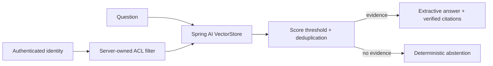

# Spring AI Secure RAG

A small, production-minded reference for **tenant-isolated retrieval**, **citation-first answers**, and **deterministic abstention** with Spring AI.

The default mode is deliberately local: a deterministic embedding model and an extractive answer composer make the entire security contract testable without an API key. The important part is real Spring AI infrastructure: `VectorStore`, portable metadata filters, scored retrieval, Micrometer observations, and Spring Boot operational endpoints.

## Why this repository exists

Many RAG demos let the prompt decide what a user may retrieve. This service does not. Identity is bound at the HTTP boundary, and application code creates an immutable `tenantId AND principalId` Spring AI filter. A request body cannot provide or override it.



## Security properties demonstrated

- Tenant and principal isolation is applied before any document becomes answer context.
- The client cannot submit a vector-store filter.
- Documents are duplicated per authorized principal so metadata remains scalar and portable across vector stores.
- Stable SHA-256 document IDs make ingestion idempotent for `(tenant, source, principal)`.
- Answers contain only retrieved excerpts and server-generated citation identifiers.
- Unknown JSON fields, invalid identity headers, excessive input, and ungrounded questions are rejected or abstained.
- Metrics count grounded and abstained queries without exporting document contents.
- Tests include a negative cross-tenant leakage case.

> [!IMPORTANT]
> `X-Tenant-Id` and `X-Principal-Id` are a local identity adapter, not authentication. In production, derive the same values from verified OIDC/JWT claims and enforce uploader authorization. See [SECURITY.md](SECURITY.md).

## Run

Requirements: Docker, or Java 21 + Maven 3.9.

```bash
docker compose up --build
```

Index a document:

```bash
curl -X POST http://localhost:8080/api/v1/documents \
  -H 'Content-Type: application/json' \
  -H 'X-Tenant-Id: acme' \
  -H 'X-Principal-Id: alice' \
  -d '{"sourceId":"runbook-42","title":"Payments recovery","content":"Restart the payments worker with the blue deployment procedure.","allowedPrincipals":["bob"]}'
```

Query as an authorized principal:

```bash
curl -X POST http://localhost:8080/api/v1/queries \
  -H 'Content-Type: application/json' \
  -H 'X-Tenant-Id: acme' \
  -H 'X-Principal-Id: bob' \
  -d '{"question":"How do I restart the payments worker?"}'
```

Operational endpoints: `/actuator/health` and `/actuator/prometheus`.

## Verify

```bash
mvn -B -ntp verify
docker build -t spring-ai-secure-rag .
```

The CI runs both commands on Java 21. No secrets or external model calls are needed.

## Design choices and production path

The in-memory `SimpleVectorStore` is explicitly a demo/test component. A production evolution keeps the `VectorStore` boundary and swaps in PgVector, uses migrations and Testcontainers, derives identity from Spring Security, separates ingestion from query traffic, and introduces a structured model response validated against the retrieved citation set. These changes are documented in [the primary-source research notes](docs/reference-research.md).

The repository uses Spring Boot 4.1.0, Spring AI 2.0.0, Java 21, locked container tags, least-privilege runtime settings, and weekly dependency updates. It is original MIT-licensed code; reference repositories and official documentation informed the architecture, but no third-party code was copied.

## Limitations

- The local feature-hashing embeddings are reproducible, not semantically equivalent to a trained embedding model.
- The in-memory index is not durable or horizontally shared.
- Principal fan-out is appropriate for a focused example; large group ACLs should use normalized policies and post-retrieval authorization.
- Header identity must not be exposed directly to untrusted clients.

## License

MIT
